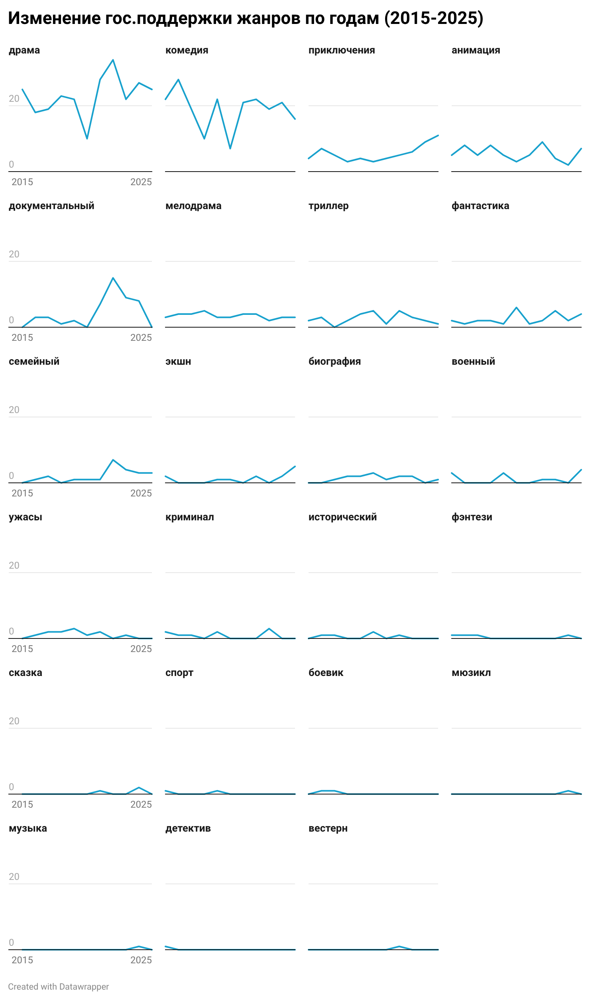
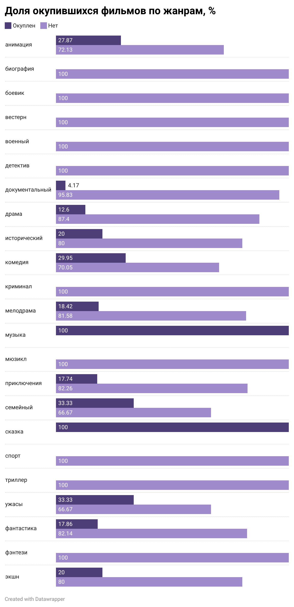

# Государственная поддержка российского кино: жанры, эффективность и коммерческий успех

## Синопсис
Проект исследует государственную поддержку российского кинематографа и ее связь с коммерческим успехом фильмов. На основе открытых данных анализируется, какие жанры получают финансирование, как меняются механизмы поддержки со временем и окупаются ли поддержанные фильмы в прокате.

Исследование объединяет данные о господдержке, характеристиках фильмов и кассовых сборах. Итог: количественная оценка эффективности различных типов финансирования и выявление структурных особенностей распределения бюджетных средств в киноиндустрии.

---

## Актуальность

Кинематограф в России является как культурным феноменом, так и важным сектором экономики с большой долей государственного участия. Ежегодно государство выделяет значительные средства на развитие киноиндустрии, но эффективность этих инвестиций вызывает общественные и профессиональные дискуссии. Понимание того, как распределяются бюджетные средства и насколько эффективно они конвертируются в зрительский интерес, важно для оценки прозрачности индустрии и анализа ее устойчивости в условиях меняющегося рынка. Не менее важно проследить, как именно менялся объем гос.поддержки в пандемию Covid-19 и период проведения СВО.

Data-driven исследование позволяет перейти от субъективных оценок к объективной картине распределения средств и коммерческих результатов.

---

## Исследовательские вопросы

1. Какие жанры российских фильмов чаще всего получают государственную поддержку?  
2. Как распределяется объем господдержки между жанрами и как он меняется со временем?  
3. Окупаются ли фильмы, получившие господдержку?  
4. Есть ли связь между жанром фильма и его окупаемостью?  
5. Как меняется структура типов государственной поддержки по годам?  
6. Зависит ли коммерческий успех фильма от типа господдержки (возрватная, невозвратная, смешанная)?  
7. Какие компании получают наибольшее количество поддержанных проектов?  

---

## Данные

В проекте использованы открытые источники данных о российском кинопрокате и государственной поддержке:

1. [Фонд кино / ЕАИС: Рейтинг фильмов, получавших государственную поддержку на производство](https://ekinobilet.fond-kino.ru/government-support/)

   Для парсинга использовалось расширение Google Chrome - Instant Data Scraper
  
2. [Бюллетень кинопрокатчика: статистика проката и жанры](https://www.kinometro.ru/kino/analitika)

    Для парсинга и очистки использовался API и Google Colab
  
3. [Портал открытых данных Министерства культуры РФ — реестр прокатных удостоверений](https://opendata.mkrf.ru/opendata/7705851331-register_movies#a:eyJ0YWIiOiJidWlsZF90YWJsZSJ9)

    Данные были получены путем скачивания .csv

---

#### Очистка данных

Сырые датасеты были объединены по названию фильма, очищены от дубликатов, приведены к единому формату и дополнены вычисляемыми показателями:
- общая сумма государственной поддержки
- тип поддержки (возвратная / безвозвратная / смешанная)  
- доля господдержки в бюджете  
- окупаемость (ROI = сборы / бюджет)  
- показатель окупаемости в формате Да/Нет

Для очистки и нормализации были применены такие функции, как:
- ВПР()
- ГОД()
- ЕСЛИ()
- СУММ()
- СЖПРОБЕЛЫ()
- ЕСЛИОШИБКА()
- ЛЕВСИМВ()
- Сортировка листа
- Фильтрация

> ### **Важно:**
>
> Исходные данные и тетрадь .ipynb доступны в папке [`data/`](data/).
>
> Очищенные данные и рабочее поле доступно по ссылке: [Google Tabs](https://docs.google.com/spreadsheets/d/1E-YcGDC-QULvyw6QD8fjXD_UmwG1PebdwUSR0t4nwAE/edit?usp=sharing).
> 

---

## Анализ

С помощью сводных таблиц был проведен глубокий анализ очищенных данных

### Основные результаты:

1. Динамика государственной поддержки жанров по годам

   Анализ динамики распределения государственной поддержки с 2015 по 2026 год выявляет четкую иерархию приоритетных жанров: безусловным лидером является драма (254 проекта), сохраняющая высокие показатели на протяжении всего периода, за ней следует комедия (207 проектов). Примечательным инсайтом является резкий рост интереса к семейному кино и анимации в последние годы (особенно в 2022–2025 гг.), что может свидетельствовать о стратегическом сдвиге государства в сторону поддержки контента для детской и семейной аудитории. В то же время нишевые жанры, такие как мюзикл, вестерн или музыкальные фильмы, получают поддержку эпизодически или крайне редко, что подчеркивает ориентацию фондов на максимально широкую аудиторию и традиционные жанровые формы. В целом структура поддержки остается устойчивой: ресурсы концентрируются в ограниченном наборе жанров, тогда как разнообразие жанрового кино поддерживается точечно.

   

2. Доля окупаемости фильмов по жанрам

   Анализ окупаемости российского киноконтента демонстрирует крайне низкий средний показатель успеха в индустрии — лишь 18,8% всех проектов выходят на самоокупаемость. При этом ярко выраженными лидерами являются жанры "сказка" и "музыка", показавшие 100% окупаемость в рамках данной выборки, что может указывать на высокую востребованность среди аудитории.

   Среди массовых жанров наиболее устойчивыми выглядят семейное кино и фильмы ужасов, каждый из которых демонстрирует окупаемость в 33,33% случаев, что значительно выше рыночного среднего и подчеркивает их потенциал как наиболее стабильных инвестиционных направлений в отечественном прокате.

   Примечательно и то, что даже приключенческий жанр и фантастика, традиционно требующие высоких бюджетов, окупаются лишь в пределах 17–18%, что сопоставимо с общим средним показателем.

   

3. Изменение типа гос. поддержки в период с 2015 по 2025 г.

   Анализ структуры государственного финансирования за период с 2015 по 2025 год демонстрирует подавляющее преимущество безвозвратной поддержки, на которую приходится 672 проекта из 835 (более 80% от общего объема). Примечательным инсайтом является резкое увеличение количества таких проектов в последние годы: если в пандемийный 2020 год поддержку получили 30 картин, то к 2022 году этот показатель вырос более чем в три раза, достигнув пика в 103 проекта. Данный тренд свидетельствует о том, что государство все чаще берет на себя основные финансовые риски производства, рассматривая киноиндустрию скорее как объект культурного субсидирования, инструмент мягкой политики и импортозамещения, нежели как чисто коммерческий рынок, предполагающий возвратность средств.

    

4. Изменение типа гос. поддержки в период с 2015 по 2025 г.

   Анализ медианного объема гос.поддержки выявляет резкий разрыв между отдельными категориями: абсолютным лидером является жанр "сказка", типичный объем поддержки для которого составляет 562,5 млн руб., что почти в два раза превышает показатели ближайшего "соседа" — жанра "экшн" (293 млн руб.). Этот инсайт подчеркивает стратегическую ставку государства на дорогостоящие зрелищные блокбастеры и национальный фольклор. В то же время для большинства популярных жанров, таких как драма и комедия, типичный объем  находится в диапазоне 35–40 млн руб., что демонстрирует стратегию поддержки: выделение сверхбюджетов для единичных событийных проектов при умеренном финансировании массового сегмента кинопроизводства.

   

5. Медианные кассовые сборы по типу поддержки.

   Анализ медианных сборов выявляет прямую зависимость между типом финансирования и кассовым успехом: фильмы, получившие возвратную поддержку, демонстрируют самые высокие медианные сборы — 170,8 млн руб.. Это в 31 раз больше, чем у проектов с безвозвратной поддержкой (5,3 млн руб.). Такой инсайт может свидетельствовать о нескольких моментах:
   - необходимость возврата средств мотивирует производителей выбирать более коммерчески потенциальные темы и эффективнее работать с маркетингом. В то время как безвозвратное финансирование чаще направляется на культурно значимые, но менее кассовые проекты.
   - смешанная поддержка занимает промежуточное положение (87,5 млн руб.), что указывает на компромиссную модель финансирования проектов со средним уровнем риска и потенциальной окупаемости
   - государство изначально отбирает для возвратного финансирования проекты с более высокой рыночной привлекательностью и широкой аудиторией, поскольку вероятность возврата вложенных средств напрямую зависит от коммерческого успеха фильма.

6. Компании-монополисты.
   Анализ распределения субсидий между участниками рынка выявляет высокую степень концентрации ресурсов в руках узкого круга игроков. Абсолютным лидером группы является ООО "КИНОКОМПАНИЯ "СТВ"", получившая поддержку для 39 проектов, что более чем в два раза превышает показатели ближайших конкурентов, таких как "МАРС МЕДИА ЭНТЕРТЕЙНМЕНТ" (18) и "ВГИК-ДЕБЮТ" (17). Возможно это связано с успешным прошлым компании СТВ в сфере съемки фильмов и предводительством режиссера С. Сельянова (Брат, Брат 2, Жмурки, Груз 200 и пр.)

   Типичным для данной группы является наличие 5–6 крупных мейджоров (включая "АРТ ПИКЧЕРС СТУДИЯ" и "ЦЕНТРАЛ ПАРТНЕРШИП"), которые формируют основу поддерживаемого государством кинопроизводства. Такая структура указывает на сформировавшуюся систему "пула лидеров", имеющих стабильный доступ к бюджетному финансированию, в то время как основная масса компаний представлена в списке единичными проектами.

---

## Референсы

- Сравнение российского и мирового кино на основе данных Letterboxd - [ссылка](https://game.deziiign.com/project/sr-a53718fa8fee416cb855f15e9297389f)
- Исследование: 80% российских фильмов с господдержкой оказались убыточными - [ссылка](https://m.business-gazeta.ru/news/671944)
- Удочка и рыба: насколько эффективна господдержка российского кинопроизводства [ссылка](https://www.proficinema.com/questions-problems/articles/detail.php?ID=429648#:~:text=%D0%9D%D0%B0%D0%BF%D1%80%D0%B8%D0%BC%D0%B5%D1%80%2C%20%60%60%D0%A5%D0%BE%D0%BB%D0%BE%D0%BF%202''%20%D0%BE%D1%82%20%D0%A6%D0%9F%D0%A8%20%D0%BE%D0%B1%D0%BE%D0%B3%D0%BD%D0%B0%D0%BB%20%D0%BF%D0%B5%D1%80%D0%B2%D1%83%D1%8E,%D0%B8%D1%85%20%D0%BF%D0%BE%D1%81%D0%BC%D0%BE%D1%82%D1%80%D0%B5%D0%BB%D0%BE%20%D0%B2%20%D0%BF%D0%BE%D0%BB%D1%82%D0%BE%D1%80%D0%B0%20%D1%80%D0%B0%D0%B7%D0%B0%20%D0%BC%D0%B5%D0%BD%D1%8C%D1%88%D0%B5%20%D0%B7%D1%80%D0%B8%D1%82%D0%B5%D0%BB%D0%B5%D0%B9.)
- Стоп, снято! Как российское кино завоевывает доверие зрителей и инвесторов [ссылка](https://roscongress.org/blog/stop-snyato-kak-rossiyskoe-kino-zavoevyvaet-doverie-zriteley-i-investorov/?utm_referrer=https%3A%2F%2Fwww.google.com%2F)

---

## Использованные инструменты

- Google Таблицы — сбор, очистка, анализ данных и визуализация  
- Google Colab - сбор по API, очистка на языке Python
- Datawrapper - визуализация данных
- GitHub — публикация проекта  
- Markdown — оформление документации
- Gemini - помощь с написанием кода для сбора данных по API

> Благодарю за внимание!
